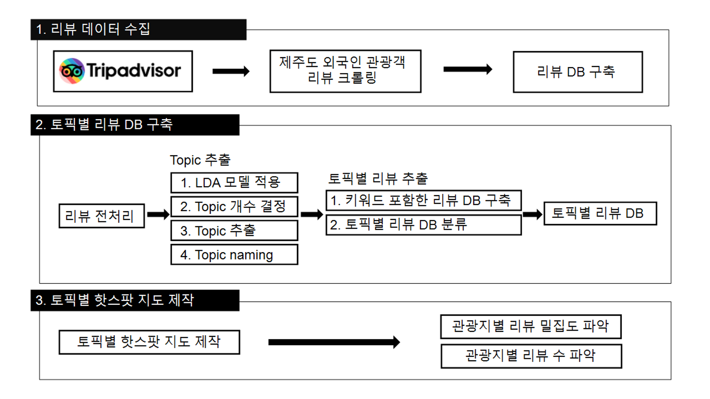
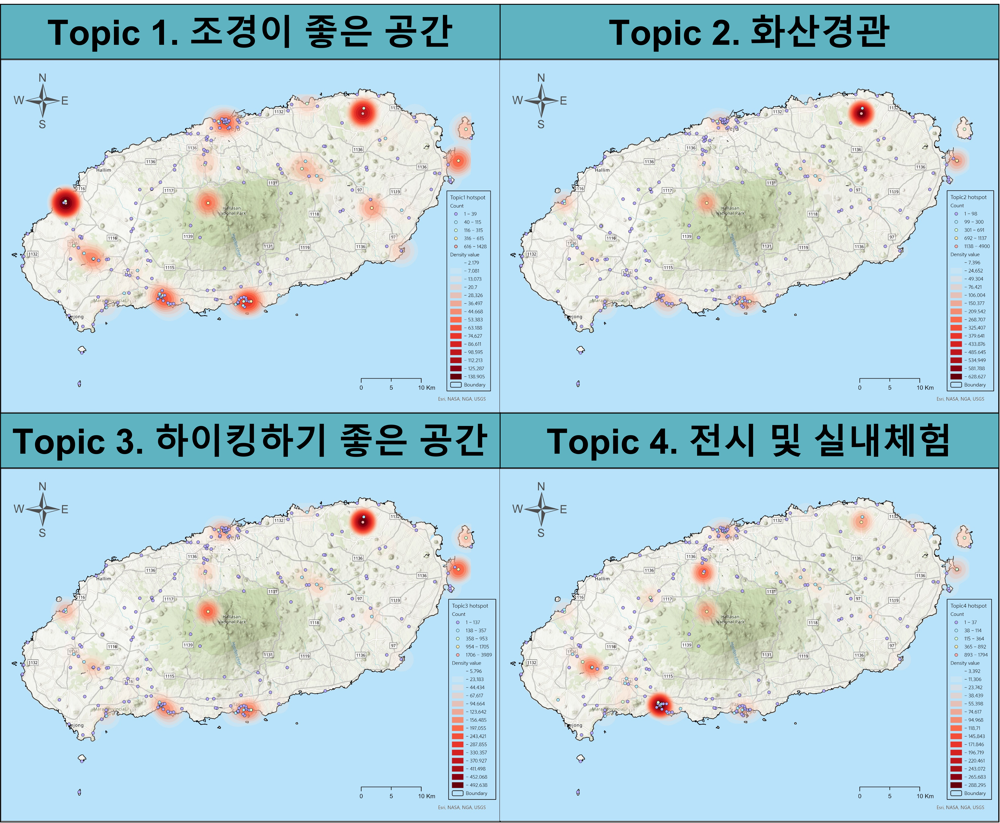

# LDA 토픽모델링 기반 제주도 외국인 관광객 여행 테마 분석

## 1. 프로젝트 개요

본 프로젝트는 TripAdvisor에 작성된 제주도 관광지 리뷰 데이터를 활용하여 **외국인 관광객의 관광 선호 테마와 공간적 방문 패턴을 분석한 연구이다.**

제주도 관광 산업은 지역 경제에서 높은 비중을 차지하고 있으며 외국인 관광객 유치는 중요한 관광 정책 과제이다. 온라인 플랫폼에 축적된 관광 리뷰 데이터는 관광객의 실제 경험과 선호를 반영한 **User Generated Content(UGC)**로 관광 트렌드를 분석하는 데 활용 가치가 높다.

이에 본 연구에서는 TripAdvisor 리뷰 데이터를 수집하여 **LDA 토픽모델링을 통해 외국인 관광객의 주요 관광 테마를 도출하고, 공간 분석을 통해 관광객 방문 패턴을 분석하였다.**

---

## 2. Analysis Pipeline

본 연구의 전체 분석 과정은 다음과 같다.

1. TripAdvisor 리뷰 데이터 크롤링
2. 리뷰 데이터 전처리
3. LDA 토픽 모델링 수행
4. 토픽별 리뷰 데이터 구축
5. 관광지 위치 기반 핫스팟 분석 수행

---

# 3. 데이터 수집

본 연구에서는 TripAdvisor에 등록된 제주도 관광지 리뷰 데이터를 크롤링하여 분석 데이터를 구축하였다.

- 수집 대상: 제주도 관광명소 **360개**
- 리뷰 데이터: **10,451개의 영어 리뷰**

수집한 데이터에는 다음 정보가 포함되어 있다.

- 관광지 이름
- 리뷰 텍스트
- 관광지 위치 정보
- 리뷰 ID

웹 페이지의 HTML 구조를 분석하여 리뷰 데이터가 저장된 태그를 확인한 후 Python 기반 크롤링을 통해 데이터를 자동으로 수집하였다.

---

# 4. 분석 방법

## 4.1 텍스트 전처리

수집된 리뷰 데이터는 비정형 텍스트 데이터이므로 LDA 분석 수행 전 전처리 과정을 수행하였다.

전처리 과정은 다음과 같다.

- 불용어 제거
- 단어 소문자 변환
- 표제어 추출
- 의미 없는 단어 제거

이를 통해 토픽 분석에 의미 없는 단어의 영향을 최소화하였다.

---

## 4.2 LDA 토픽모델링

본 연구에서는 대량의 텍스트 데이터에서 잠재된 주제를 추출하기 위해 **LDA (Latent Dirichlet Allocation)** 모델을 활용하였다.

LDA는 문서 집합 내에 존재하는 잠재적인 토픽을 확률적으로 추정하는 토픽 모델링 기법이다.

LDA 분석을 통해 총 **6개의 토픽을 추출하였으며**, 의미 해석이 어려운 토픽을 제외하고 **최종적으로 4개의 관광 테마를 도출하였다.**

### 도출된 관광 테마

| Topic | 관광 테마 | 주요 키워드 |
|------|-----------|------------|
| Topic 1 | 조경이 좋은 공간 | garden, park, tree, flower |
| Topic 2 | 화산 경관 | cave, lava, rock |
| Topic 3 | 하이킹하기 좋은 공간 | trail, hike, mountain |
| Topic 4 | 전시 및 실내 체험 | museum, exhibit, art |

LDA 분석 결과 외국인 관광객은 제주도의 **자연 환경과 관련된 관광 활동에 높은 관심을 보이는 것으로 나타났다.**

---

# 5. 공간 분석

## 5.1 전체 리뷰 핫스팟 분석

외국인 관광객의 방문 밀도를 파악하기 위해 **Kernel Density Estimation 기반 핫스팟 분석**을 수행하였다.

핫스팟 분석 결과 외국인 관광객의 방문은 **특정 지역에 집중되는 경향**을 보였다.

### 대표 관광 핫스팟 지역

- 성산일출봉
- 만장굴
- 한라산 국립공원
- 정방폭포
- 대포 주상절리

이는 외국인 관광객이 제주도의 **자연 경관 중심 관광지에 집중적으로 방문하는 경향이 있음을 의미한다.**

---

# 6. 주요 분석 결과

LDA 분석을 통해 외국인 관광객의 관광 테마 선호도를 확인할 수 있었다.

토픽별 리뷰 수 분석 결과 외국인 관광객의 관광 테마 선호도는 다음과 같은 순서로 나타났다.

1. 하이킹하기 좋은 공간  
2. 화산 지형  
3. 조경이 좋은 공간  
4. 전시 및 실내 체험  

이러한 결과는 외국인 관광객이 제주도 관광에서 **자연경관 기반의 야외 활동을 선호하는 경향**이 있음을 보여준다.

또한 관광객 방문은 제주도 전역에 분산되지 않고 **특정 관광지에 집중되는 패턴**을 보였다.

---

# 7. 결과 시각화

## 관광 리뷰 핫스팟 지도

---

# 8. 프로젝트 구조

jeju-foreign-tourist-topic-analysis
data
└ 리뷰 데이터
src
├ crawling
├ preprocessing
└ topic_modeling
└ LDA.py
outputs
└ maps
└ hotspot_analysis.png
README.md

---

# 9. 연구 의의

본 연구는 TripAdvisor 리뷰 데이터를 활용하여 **외국인 관광객의 제주도 관광 선호를 데이터 기반으로 분석했다는 점에서 의의가 있다.**

또한 텍스트 분석(LDA)과 공간 분석(Hotspot Analysis)을 결합하여 외국인 관광객의 **관광 테마와 공간적 이용 패턴을 동시에 분석하였다.**

연구 결과는 향후 제주도의 외국인 관광 정책 수립 및 관광 콘텐츠 기획에 활용될 수 있다.

---

# 10. 연구 한계

본 연구는 다음과 같은 한계를 가진다.

- 코로나19 영향으로 최신 관광 트렌드를 충분히 반영하지 못하였다.
- TripAdvisor 리뷰 데이터에 한정된 분석이라는 점에서 데이터 편향 가능성이 존재한다.
- 일부 관광지에 리뷰가 집중되는 데이터 특성이 존재한다.
